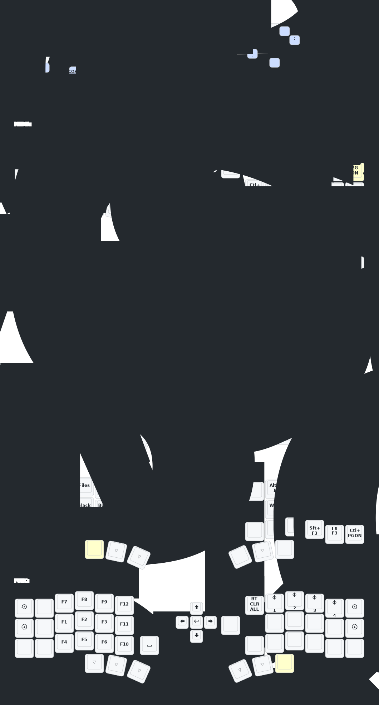

# ZMK Keyboard config

This repo contains configuration files for keyboards using the ZMK firmware.

I am slowly trying to replicate the keymap I use on
[my QMK keyboards](https://github.com/y-muller/personal_configs/blob/main/qmk_keyboards/CORNE42.md).

## Corne-j

This is my first ZMK keyboard.

This keyboard is sold by several Chinese vendors, under different names. Despite the
name it has little to do with the original Corne. The layout is very similar, but adds
a rotary encoder on the left side and a five-way switch on the right. It has two low-power
screens that are compatible with the nice!view.

I am using this [module](https://github.com/a741725193/zmk-new_corne).

##### What is missing or broken so far
- tmux mode (Ctrl-A prefix)
- select mode
- Alt-Tab on Nav layer
- leader key
- layer locking is rather awkward (symbols, extend, media)
- the keymap-drawer config is completely broken

